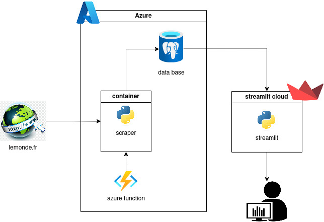

# school-project-01

## Architecture

- Scraper container will scrap 'le monde' and provide database host on Azure
- The scraper container is triggered everydays by azure function (dont work yet)
- Streamlit app take data from database to visualize data
- Degraded mode: if database is out, data are automatically provide by csv for continuous visualisation




## init
Run init-db.sh for initialize Azure database
```
bash deployment/script/init-db.sh
```

## update scraper container on azure
Run azure_update-db.sh for update scraper container on Azure
```
bash deployment/script/azure_update-db.sh
```

## visualize
Click [here](https://projet-m1.streamlit.app/)
to go to streamlit
